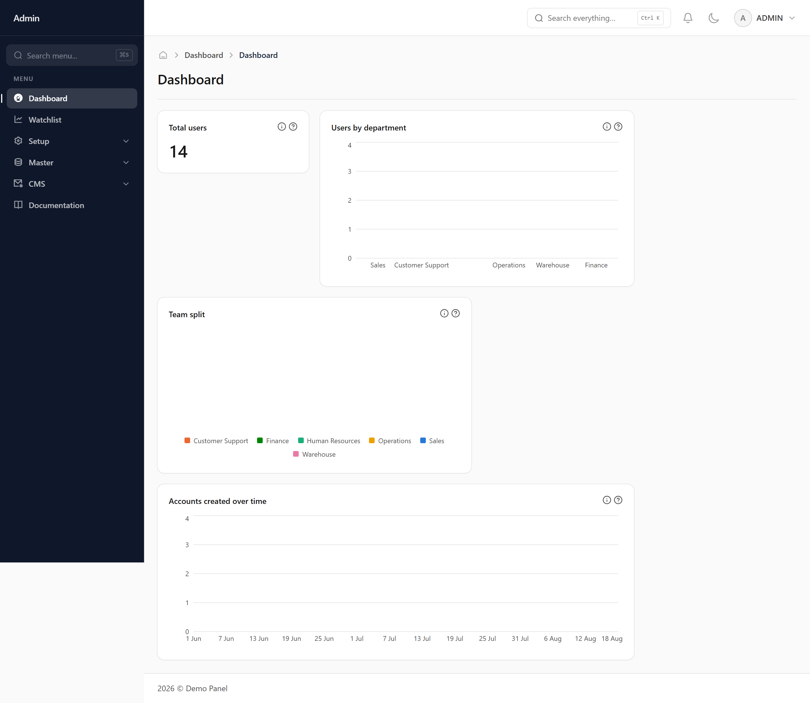
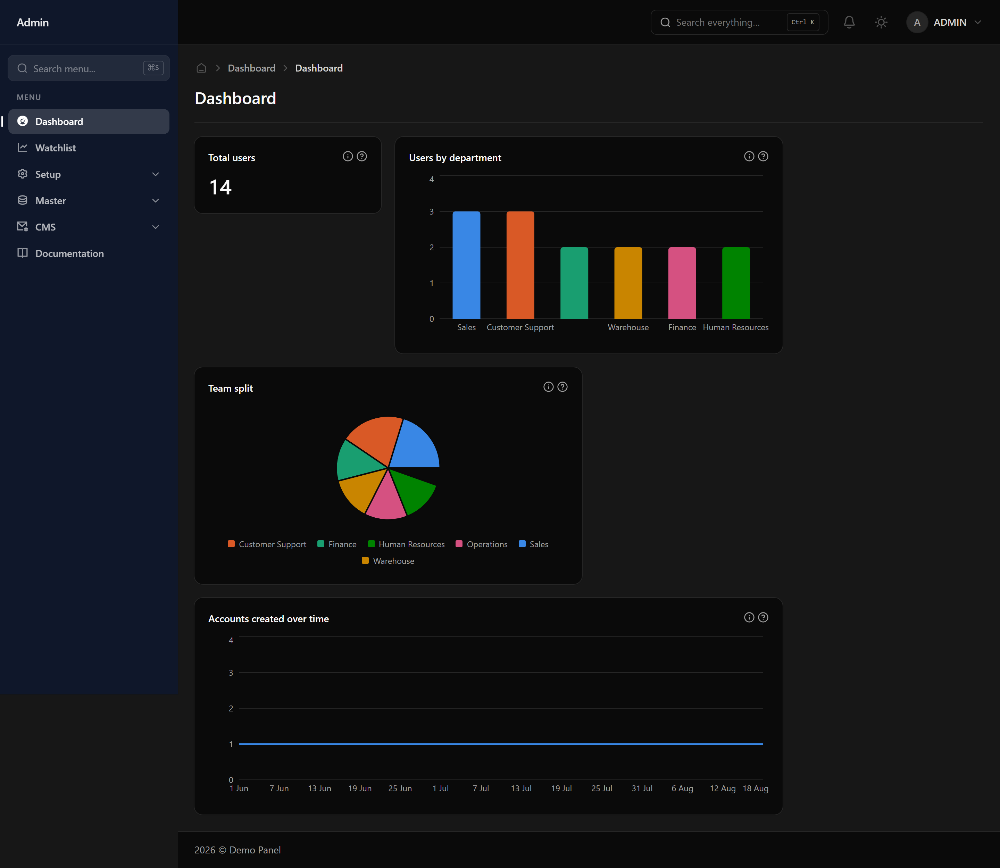

# Dashboard

The first screen after signing in. It shows the charts and figures chosen for your role.

## What you are looking at

Each card is one measure — a total, a breakdown by category, or a trend over time. Which cards appear depends on your role, so two people signing in may see different dashboards.

## The numbers only cover what you can see

If your role is limited to your own department, every figure here counts only your department's records. Two people looking at the same card can legitimately see different totals.

## Finding out what a figure means

A card with an information icon has an explanation behind it, written by whoever built it, plus a breakdown of how the total splits up. If a number surprises you, check there first.

## Finding anything: the search box

The "Search everything" box at the top of every screen (or Ctrl+K, ⌘K on a Mac) looks through screen names, records and the activity logs at once. Type at least two letters. Results are grouped by where they live, the matching text is highlighted, and each one says which detail matched — a name, an email, a path. Use the arrow keys and Enter, or click. A record opens on its own page; a log entry opens its log already filtered to what you typed. Search only ever shows what your role is allowed to open, so a colleague may find things you do not. Up to five results per kind are shown — if what you want is not there, type a little more.
