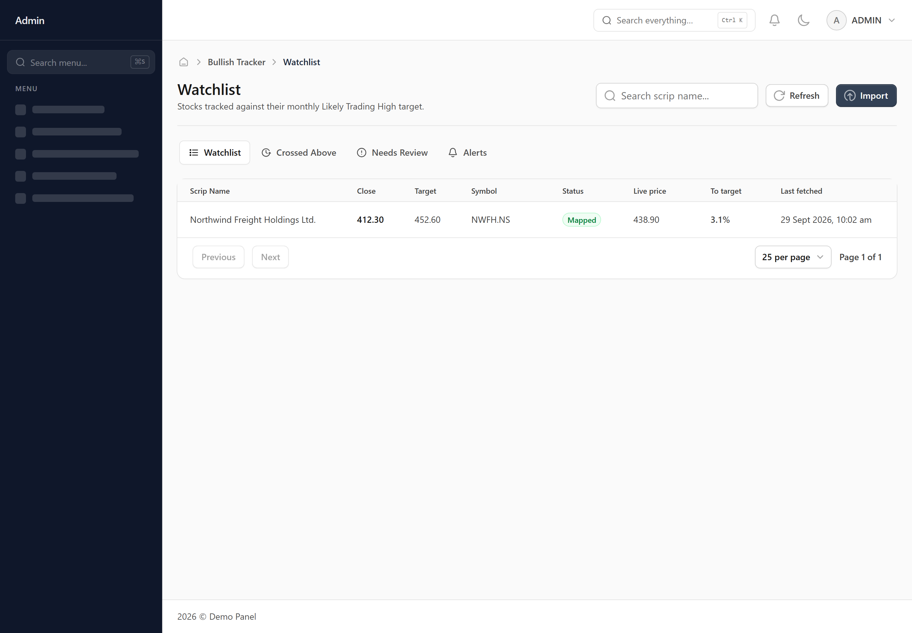
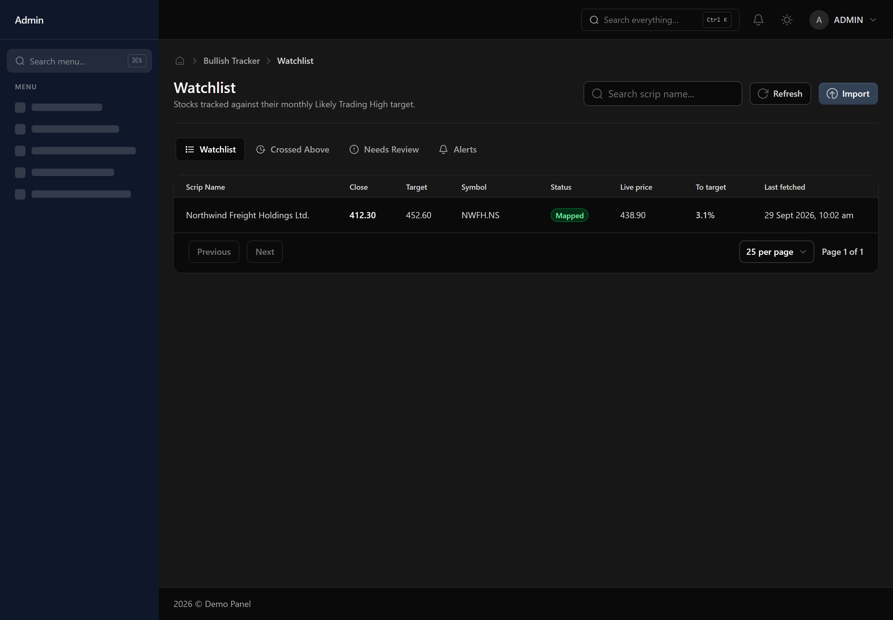

# Watchlist

Stocks you are tracking against a monthly target price, with their live price, how close each one is, and which ones still need a little help finding the right match.

## Importing the monthly sheet

The "Import" button takes the .xlsx sheet you get each month — the scrip name, its last close price, and its likely trading range. Only the top of that range (the "likely trading high") becomes the target this screen tracks. You then choose whether this import should Update (refresh targets for stocks already here, add any new ones, and leave everything else untouched) or Replace (this month's sheet becomes the whole list — start with Update unless you specifically want a clean slate). A full sheet of a few hundred stocks can take several minutes to import, because each new name is looked up one at a time — you do not need to keep the window open while it works; the screen updates itself when it is done.

## The four tabs

Watchlist is everything currently being tracked, price-checked once a minute while the market is open. Needs Review is anything the import could not confidently match to a real stock on its own — a company's name on the sheet does not always match its official trading name exactly, so this is expected, especially on your first import. Crossed Above holds every stock whose live price has gone above its target, with the date it happened — once a stock lands here it stays here for the rest of the month, even if the price dips back down, though it is still watched in case it crosses again on a later day. Alerts is the running record of every crossing, oldest to newest.

## Live price and how close a stock is

"Live price" and "Last fetched" show the most recent price this screen has and when it was checked — prices only update while the market is open (NSE hours, weekdays). "To target" is how far, as a percentage, the live price still has to rise to reach the target: the closer to 0%, the closer it is to crossing. Once it crosses, this turns green and negative, showing how far above the target it now is. The Watchlist tab is ordered with the closest stocks first.

## Getting notified

The bell icon at the top of every screen shows how many stocks have crossed their target today, and takes you straight to the Alerts tab. It clears itself at midnight — nothing to mark as read. A stock only ever alerts once per day, even if it stays above its target the whole session; it can alert again on a later day if it crosses again.

## Matching a stock manually

Press "Match" on any row in Needs Review. Type a clearer version of the company name if the first search comes back empty or wrong — searching "ABB India" instead of just "ABB", for instance, is often what it takes when a name is shared with an unrelated foreign company. Pick the right one from the results and it is saved. Once you have matched a name, you never have to match it again on a future import.
